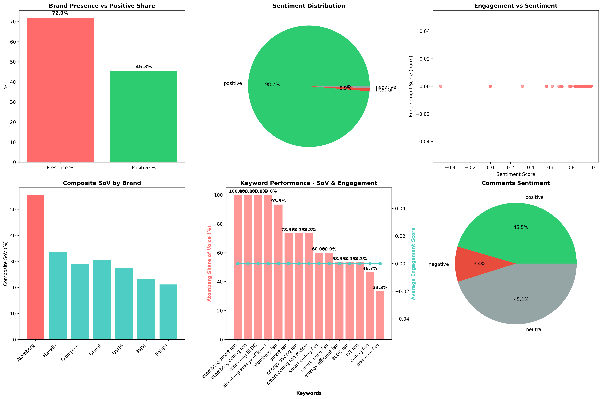

## Atomberg YouTube Share-of-Voice (SoV) Report

### Page 1 — Tech stack, approach, and reproducibility

- **Language**: Python 3.10+
- **Core libraries**:
  - **Data/ML**: `pandas`, `numpy`
  - **NLP**: custom preprocessing + VADER/TextBlob-backed scoring (wrapped in `nlp_utils.py`)
  - **Visualization**: `matplotlib`
  - **YouTube API**: YouTube Data API v3 (search, videos, commentThreads)
- **Project modules (cleaned)**
  - `main.py`: single entrypoint (extract → CSV → process → plots)
  - `collectors.py`: YouTube search + videos + comments/replies
  - `metrics.py`: SoV metrics, engagement model, presence, sentiment, composite index
  - `nlp_utils.py`: text preprocessing, sentiment scoring, brand mention extraction
  - `visuals.py`: final dashboard plots
  - `config.py`: configuration (limits, weights, paths)
- **Data flow**
  1) Extract videos for target keywords and save to CSV in `reports/` (includes titles, descriptions, channel title, stats, comments/replies).
  2) Reload CSV (no additional API calls), enrich with NLP features and weights.
  3) Compute SoV metrics:
     - Presence Rate
     - Basic SoV (content mentions)
     - Comments SoV (comment-level mentions)
     - Positive Share (brand-mention comments)
     - Composite Index (weighted)
     - Brand benchmarking
  4) Produce dashboard to `plots/`.
- **Formulas (key ones)**
  - Presence Rate = videos with brand mention / total videos × 100
  - Basic SoV = Atomberg content mentions / total content mentions × 100
  - Comments SoV = Atomberg comment mentions / total brand comment mentions × 100
  - Engagement value per video = views/1000 + 2×likes + 3×comments + commentLikes (fallback uses comment count/likes if stats missing)
  - Composite Index = weighted sum of Basic SoV, Positive Share, Visibility, Engagement (weights tunable in `config.py`)
- **Reproducibility**
  - Extract + process: `python main.py --extract`
  - Process latest CSV: `python main.py`
  - Process specific CSV: `python main.py reports/sov_extracted_YYYYMMDD_HHMMSS.csv`

---

### Page 2 — Findings and recommendations

#### Executive summary (YouTube-only, latest CSV)

- **Presence Rate**: 72.00%
- **Basic SoV**: 71.56%
- **Comments SoV**: 67.04%
- **Positive Share (comments)**: 45.33%
- **Composite Index**: 69.16%
- Totals: engagement 10,474; Atomberg engagement 8,488; brand comment mentions 1,344 total, 901 Atomberg

Interpretation:

- Atomberg’s content presence around smart fan topics is strong (>70% presence).
- Comment-level share is also strong (~67%), indicating meaningful community discussion.
- Positive share ~45% suggests largely favorable sentiment with room to lift positivity via content and community tactics.

#### Visual dashboard



#### Observations

- High presence and Basic SoV across “smart fan”, “BLDC fan”, and “energy efficient fan” clusters.
- Comments sentiment shows a healthy positive/neutral mix, with a non-trivial negative slice (~9–10%).
- Composite by brand indicates a consistent lead over key competitors (Havells, Crompton, Orient), but the gap is close enough to warrant proactive content and community playbooks.

#### Recommendations to Atomberg team

- **Content and programming**
  - Produce “What is BLDC?” and “How BLDC saves bills” explainers with bill comparisons and real-home demos; pin to smart fan playlists.
  - Release “90-second product quick takes” for each model SKU; add chapters and shopping links; repurpose to Shorts.
  - Launch “Troubleshooting + Maintenance” micro-FAQ videos to pre-empt negative comments and convert neutrals to positives.
  - Double down on “smart home integrations” content (voice assistants, routines, energy dashboards); collaborate with home-automation creators.
- **Community and engagement**
  - Add a structured reply rubric for recurring questions/critiques; respond within 24–48 hours on videos with accelerating comment velocity.
  - Highlight and pin customer testimonials; invite upgrade stories (“from old AC induction to BLDC”) with bill screenshots.
  - Run UGC prompts: “Show your Atomberg setup” with a monthly community shoutout; repost the best on Shorts.
- **Influencer and partnerships**
  - Partner with eco-living, DIY, and home-improvement creators for “Before vs After” BLDC swaps.
  - Seed products for small and mid-tier creators to expand coverage breadth (Composite Index lifts with more mid-tail videos).
- **Distribution and SEO**
  - Standardize metadata: include “Atomberg BLDC”, “smart fan”, “energy efficiency”, “bill savings” in titles, descriptions, tags; add CTAs and PDP links.
  - Localize: produce Hindi + regional variants for top-performers; consider bilingual captions for Shorts.
  - Playlists: create funnel-based playlists (Learn → Compare → Buy) and regional language playlists.
- **Measurement and iteration**
  - Track weekly: Presence Rate, Basic SoV, Comments SoV, Positive Share, Composite Index; time-to-first-reply; “response uplift” on sentiment.
  - Thumbnail/title A/Bs on 3–5 best performers each month.
  - Refresh and re-upload “evergreen explainer” content yearly with new data and testimonials.

#### Appendix — How to reproduce locally

```bash
# 1) Extract and process (YouTube API needed for extraction)
python main.py --extract

# 2) Process latest saved CSV only (no API calls)
python main.py

# 3) Process a specific CSV
python main.py reports/sov_extracted_YYYYMMDD_HHMMSS.csv
```


